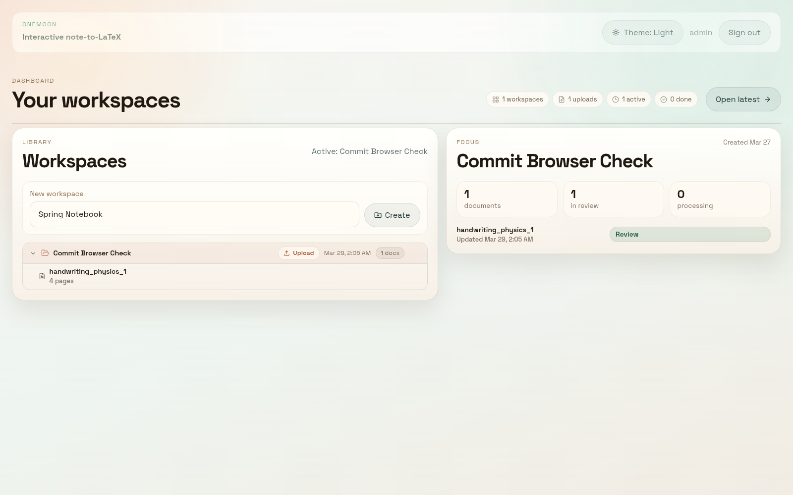
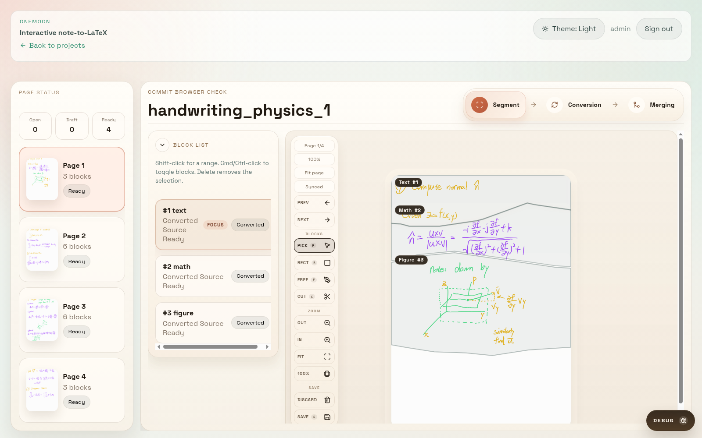
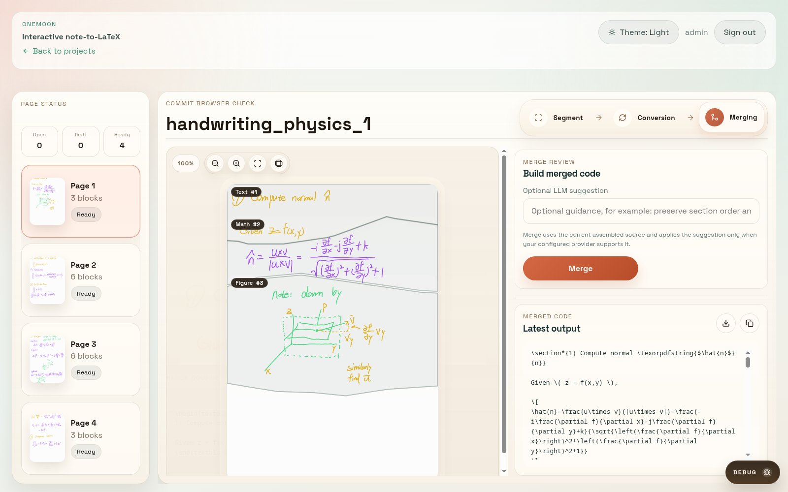

# OneMoon

OneMoon is a human-in-the-loop note-to-LaTeX workspace. It takes handwritten notes, screenshots, or PDFs through upload, page review, block conversion, and final LaTeX packaging in one flow.

## What It Does

- Upload a document into a workspace and review pages in a browser-based editor.
- Segment handwritten content into text, math, and figure blocks.
- Convert blocks with a configured LLM provider or keep using the built-in mock provider for local development.
- Merge the assembled output into LaTeX and download a package that includes the source plus a relative `figures/` folder.

## Screenshots

<p>
  
  
  
</p>

## Core Flow

1. Create or open a workspace.
2. Upload a PDF or image document.
3. Review each page and adjust block segmentation where needed.
4. Convert blocks in `Conversion` mode.
5. Merge the assembled source in `Merging` mode and download the resulting package.

## Stack

- Frontend: React, TypeScript, Vite
- Backend: FastAPI, SQLAlchemy, Python processing pipeline
- Storage: local `data/` directory for uploads, rendered pages, crops, and generated artifacts

## Run Locally

Start both apps from the repo root:

```bash
npm install
npm run dev
```

- Frontend: `http://localhost:5173`
- Backend: `http://localhost:8000`

Run the apps separately when needed:

```bash
cd apps/backend
uv sync --dev
uv run onemoon-backend
```

```bash
cd apps/frontend
npm install
npm run dev
```

## Default Login

- Username: `admin`
- Password: `onemoon`

## LLM Configuration

OneMoon stays usable without an external model. If no real provider is configured, the backend falls back to the mock provider so the upload-to-review workflow still runs locally.

To enable a real provider, configure `apps/backend/.env` or the repo-root `.env` with your `ONEMOON_*` / provider-specific LLM settings before starting the backend.

## Verification

```bash
cd apps/backend && uv run pytest
cd apps/frontend && npm run build
```

More detailed app-specific notes live in [apps/frontend/README.md](apps/frontend/README.md) and [apps/backend/README.md](apps/backend/README.md).
